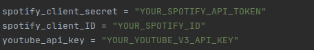
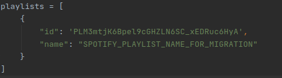

# Youtube-Spotify-playlist-migrator
This script takes all the songs videos from a Youtube playlist and migrates to a Spotify playlist
## Installation
Use the package manager [pip3](https://pip.pypa.io/en/stable/) and [venv](https://pypi.org/project/virtualenv/) to install all the requirements that the script needs.

```bash
cd Youtube-Spotify-playlist-migrator
source venv/bin/activate
pip3 install -r requirements.txt
```

## Setup
The script connects to the [Youtube V3 API](https://developers.google.com/youtube/v3) and to the [Spotify](https://developer.spotify.com/) one, so corresponding credentials are required.  
Insert those keys at the config.py file like this:  



Also the Youtube  playlists that you want to migrate and the matched Spotify playlist name is required, you can specify this at the config.py file too.  
pd: the playlist cant be "private"  

  



See that the script can migrate multiple playlists at once, or join them in the same Spotify playlist.


## Usage
Once configuration's done, just run the following command:

```bash
python3 run.py
```

## Contributing
Pull requests are welcome. For major changes, please open an issue first to discuss what you would like to change.

Please make sure to update tests as appropriate.

## License
[MIT](https://choosealicense.com/licenses/mit/)

## Changelog
 none
## Fixings
none